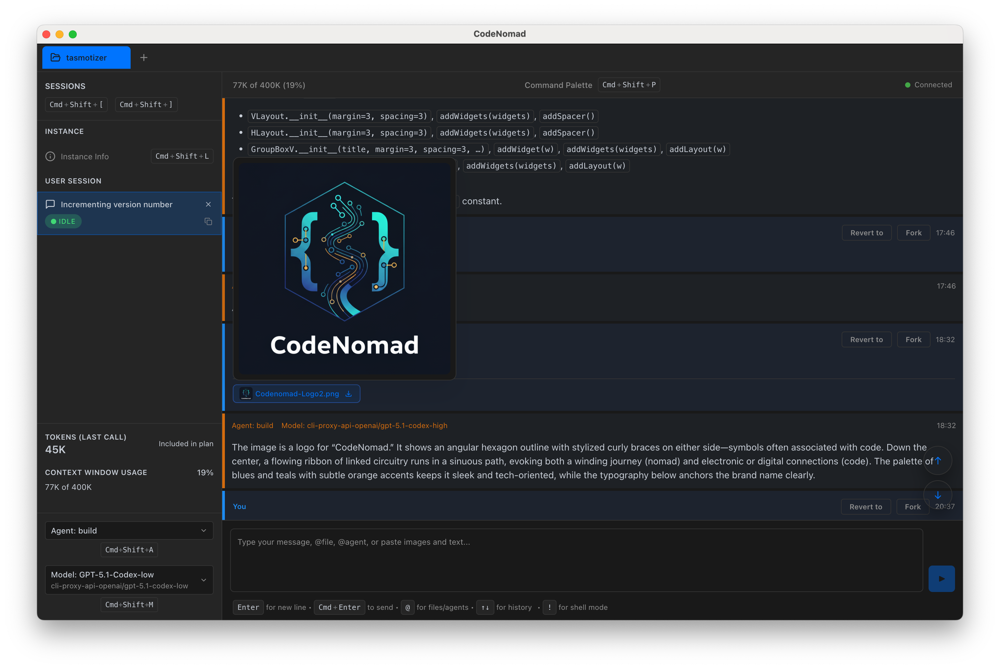
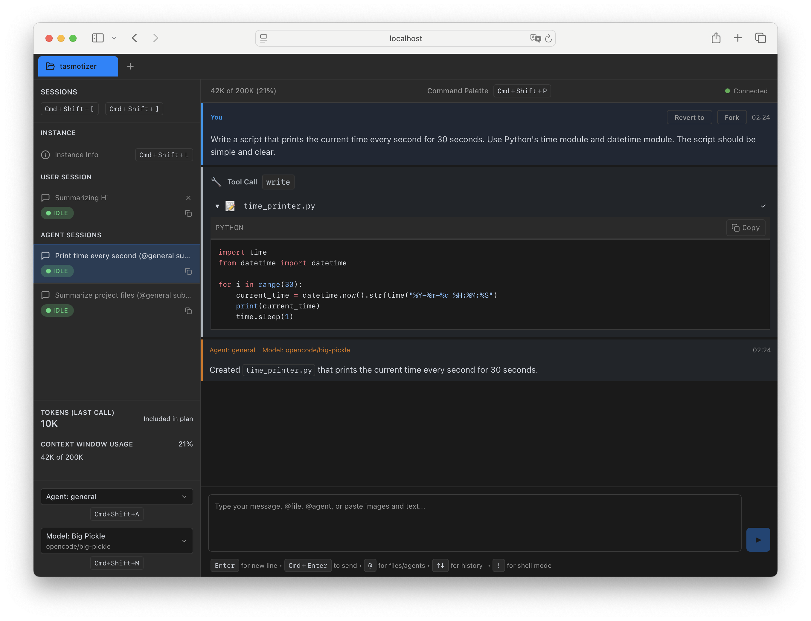

# CodeNomad

## A fast, multi-instance workspace for running OpenCode sessions.

CodeNomad is built for people who live inside OpenCode for hours on end and need a cockpit, not a kiosk. It delivers a premium, low-latency workspace that favors speed, clarity, and direct control.

> [!IMPORTANT]
> **This is a fork of the original [shantur/CodeNomad](https://github.com/shantur/CodeNomad) repository.** This fork includes enhancements from PRs that diverge from the upstream main branch. These changes are included in all builds generated from this repository.


_Manage multiple OpenCode sessions side-by-side._

<details>
<summary>📸 More Screenshots</summary>


_Global command palette for keyboard-first control._


_Rich media previews for images and assets._


_Browser support via CodeNomad Server._

</details>

## Getting Started

Choose the way that fits your workflow:

### 🖥️ Desktop App (Recommended)

The best experience. A native application (Electron-based) with global shortcuts, deeper system integration, and a dedicated window.

- **Download**: Grab the latest installer for macOS, Windows, or Linux from the [Releases Page](https://github.com/shantur/CodeNomad/releases).
- **Run**: Install and launch like any other app.

### 🦀 Tauri App (Experimental)

We are also working on a lightweight, high-performance version built with [Tauri](https://tauri.app). It is currently in active development.

- **Download**: Experimental builds are available on the [Releases Page](https://github.com/shantur/CodeNomad/releases).
- **Source**: Check out `packages/tauri-app` if you're interested in contributing.

### 💻 Build from Source

Run CodeNomad as a local server by building from source. Perfect for remote development (SSH/VPN) or running as a service.

```bash
# Clone the repository
git clone https://github.com/bizzkoot/CodeNomad.git
cd CodeNomad

# Install dependencies
npm install --workspaces

# Build and launch the server
npm run build --workspace @neuralnomads/codenomad
npm run start --workspace @neuralnomads/codenomad
```

This will start the server and you can access it at http://localhost:3000

## Highlights

- **Multi-Instance**: Juggle several OpenCode sessions side-by-side with tabs.
- **Long-Session Native**: Scroll through massive transcripts without hitches.
- **Command Palette**: A single global palette to jump tabs, launch tools, and control everything.
- **Deep Task Awareness**: Monitor background tasks and child sessions without losing flow.

### ⚡ Feature Spotlight: Zero-Cost `ask_user` (MCP)

We've replaced the standard `question` tool with a native **Model Context Protocol (MCP)** implementation called `ask_user`.

| Feature          | Legacy `question` Tool               | New `ask_user` MCP Tool              |
| :--------------- | :----------------------------------- | :----------------------------------- |
| **Cost**         | Consumes premium requests per answer | **Zero** premium request consumption |
| **Architecture** | Remote API loop                      | Local IPC + MCP Server               |
| **Timeout**      | Short default timeout                | **5-minute timeout** (configurable)  |
| **UX**           | Standard                             | Rich Markdown, Minimizable Wizard    |

> [!TIP]
> **Adjusting Timeout Duration**
> You can configure the `ask_user` timeout in the **Advanced Settings** menu found on the start screen (before opening a project).
>
> 1. Launch CodeNomad.
> 2. On the welcome screen, click **Advanced Settings**.
> 3. Scroll to **Timeout Settings** and adjust the value (default: 300s).

This change is critical for users on metered plans (like GitHub Copilot), effectively "unlocking" unlimited user interactions without draining quotas.

### 🔄 Upstream/dev Sync (Since commit 444335ad)

This fork selectively merges features from upstream while preserving fork-specific architecture.

#### ✅ Successfully Merged (v0.10.3 line)

| Category | Feature | Commit |
| :-- | :-- | :-- |
| **🔧 Server API** | `GET /api/workspaces/:id/git/file-original` endpoint for fetching file HEAD/staged content | infrastructure preserved |
| **🔌 API Client** | `fetchGitOriginalContent()` method for Monaco diff preparation | infrastructure preserved |
| **🛡️ Stability** | Git store optional chaining safety fix | `755b768` |
| **🛡️ Stability** | Permission/Question block null checks | `permission-block.tsx`, `question-block.tsx` |
| **🛡️ Stability** | "Object has been destroyed" Electron crash fix | `13edfa4` |
| **⚡ Platform** | Power save blocker wake lock during busy instances | `3393911` |
| **🎨 UI Polish** | Sticky header background for bash tool output | `d8b018a` |
| **🎨 UI Polish** | Diff syntax highlighting for code blocks | `a06aa01` |
| **🔧 DevEx** | Electron dev startup CLI detection and URL swap fixes | `5f113c3` |
| **📦 Release** | Version bump to 0.10.3 | `11deb19` |

#### ⏸️ Deferred to Custom Implementation

These features require architectural alignment with fork patterns and are documented in PR.md:

| Category | Upstream Feature | Status |
| :-- | :-- | :-- |
| **🧭 Right Panel & Session Changes** | Changes/Status tabs with session diff hydration | Use existing RightPanel tabs |
| **🧩 Monaco Diff/File Viewers** | Monaco-powered changes/files viewers in SourceControlPanel | Infrastructure ready; custom UI needed |
| **🌳 Worktrees & Git UX** | Worktree file browser in SourceControlPanel | Infrastructure ready; custom UI needed |
| **🎨 Theme & UI Polish** | System/light/dark theme toggle | Fork uses different theme system |
| **⌨️ Prompt & Message UX** | Enter-to-submit toggle, message-part delete | Preserved in fork-specific implementation |

> **Note**: The server infrastructure for Monaco diff and worktrees is preserved (API endpoints and client methods). Custom UI implementation can leverage these when architecturally aligned.

## Requirements

- **[OpenCode CLI](https://opencode.ai)**: Must be installed and available in your `PATH`.
- **Node.js 18+**: Required if running the CLI server or building from source.

## Enhanced Features (Fork-Specific)

This fork includes several major enhancements not available in the upstream repository:

| Feature              | Key Capabilities                                                                                                                                                                                                                            |
| :------------------- | :------------------------------------------------------------------------------------------------------------------------------------------------------------------------------------------------------------------------------------------ |
| **🎯 Native MCP**     | • **Zero-Cost Interactions**: No premium usage for questions<br>• **Reliability**: 5-minute timeout with auto-retry logic<br>• **Rich UI**: Minimizable markdown wizard & mobile optimization                                               |
| **📂 Source Control** | • **Git Integration**: Built-in status, diff viewer, and branch management<br>• **Smart Previews**: View untracked files with binary detection<br>• **Actions**: Publish branches and delete files directly                                 |
| **🔔 Notifications**  | • **Persistent**: Error banner for timed-out questions/tasks<br>• **Recovery**: One-click retry without losing context<br>• **Rich Details**: Markdown-rendered failed question panel<br>• **State**: Notifications persist across restarts |
| **🔍 Chat Search**    | • **Deep Search**: Query entire history with debounced input<br>• **Visual**: Result highlighting and auto-expansion of collapsed blocks                                                                                                    |
| **🌳 Folder Tree**    | • **Navigation**: VSCode-style file explorer for workspaces<br>• **Preview**: Instant GitHub-style markdown rendering                                                                                                                       |
| **📝 Enhanced Input** | • **Editor**: Expandable multi-line chat input<br>• **Smart Attachments**: Tab-key file selection & auto-collapse                                                                                                                           |
| **🎨 Polish & Perf**  | • **Visual**: Seamless dark mode, improved split-view diffs<br>• **Speed**: 10x faster dev icon loading via Vite optimization                                                                                                               |

> [!NOTE]
> These features are not included in upstream and represent divergent functionality from the original CodeNomad repository.

_Last updated: 2026-02-15_

## CI/CD on Forks

Since this repository uses GitHub Actions for automated releases, forks may encounter failures in the `release-ui` and `publish-server` jobs due to missing secrets (`CLOUDFLARE_API_TOKEN`, `NPM_TOKEN`) or version conflicts.

To prevent these failures, the workflows are configured to **skip** these specific jobs unless running on the upstream repository or if explicitly enabled. The `build-and-upload` job (which generates the release binaries) will still run and attach artifacts to the GitHub Release on your fork.

## Troubleshooting

### macOS says the app is damaged

If macOS reports that "CodeNomad.app is damaged and can't be opened," Gatekeeper flagged the download because the app is not yet notarized. You can clear the quarantine flag after moving CodeNomad into `/Applications`:

```bash
xattr -l /Applications/CodeNomad.app
xattr -dr com.apple.quarantine /Applications/CodeNomad.app
```

After removing the quarantine attribute, launch the app normally. On Intel Macs you may also need to approve CodeNomad from **System Settings → Privacy & Security** the first time you run it.

### Linux (Wayland + NVIDIA): Tauri AppImage closes immediately

On some Wayland compositor + NVIDIA driver setups, WebKitGTK can fail to initialize its DMA-BUF/GBM path and the Tauri build may exit right away.

Try running with one of these environment variables:

```bash
# Most reliable workaround (can reduce rendering performance)
WEBKIT_DISABLE_DMABUF_RENDERER=1 codenomad

# Alternative for some Wayland setups
__NV_DISABLE_EXPLICIT_SYNC=1 codenomad
```

If you're running the Tauri AppImage and want the workaround applied every time, create a tiny wrapper script on your `PATH`:

```bash
#!/bin/bash
export WEBKIT_DISABLE_DMABUF_RENDERER=1
exec ~/.local/share/bauh/appimage/installed/codenomad/CodeNomad-Tauri-0.4.0-linux-x64.AppImage "$@"
```

Upstream tracking: https://github.com/tauri-apps/tauri/issues/10702

## Architecture & Development

CodeNomad is a monorepo split into specialized packages. If you want to contribute or build from source, check out the individual package documentation:

| Package                                                      | Description                                                                       |
| ------------------------------------------------------------ | --------------------------------------------------------------------------------- |
| **[packages/electron-app](packages/electron-app/README.md)** | The native desktop application shell. Wraps the UI and Server.                    |
| **[packages/server](packages/server/README.md)**             | The core logic and CLI. Manages workspaces, proxies OpenCode, and serves the API. |
| **[packages/ui](packages/ui/README.md)**                     | The SolidJS-based frontend. Fast, reactive, and beautiful.                        |

### Quick Build

To build the Desktop App from source:

1.  Clone the repo.
2.  Run `npm install` (requires pnpm or npm 7+ for workspaces).
3.  Run `npm run build --workspace @neuralnomads/codenomad-electron-app`.
