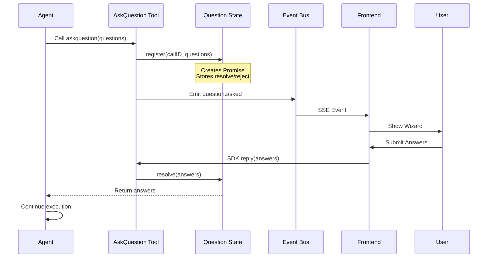

# AskQuestion Tool Integration

## Document Overview

This document provides comprehensive documentation for integrating the `askquestion` tool from shuvcode into CodeNomad. It covers research findings, architecture analysis, approach evaluation, and detailed implementation plan.

**Status:** Phase 2 Complete ✅  
**Approach:** Minimal Integration (SDK Passthrough)  
**Started:** 2026-01-10  
**Phase 1 Completed:** 2026-01-10  
**Phase 2 Completed:** 2026-01-10  
**Author:** AI Assistant

## Implementation Status

### ✅ Phase 1: Frontend Component (COMPLETE)
- [x] Created question type definitions (`types/question.ts`)
- [x] Created question store for queue management (`stores/questions.ts`)
- [x] Ported AskQuestionWizard component from shuvcode (`components/askquestion-wizard.tsx`)
- [x] Created stylesheet with CodeNomad design tokens (`styles/components/askquestion-wizard.css`)
- [x] Added CSS import to controls.css

**Files Created:**
- `packages/ui/src/types/question.ts` (47 lines)
- `packages/ui/src/stores/questions.ts` (85 lines)
- `packages/ui/src/components/askquestion-wizard.tsx` (457 lines)
- `packages/ui/src/styles/components/askquestion-wizard.css` (302 lines)

**Files Modified:**
- `packages/ui/src/styles/controls.css` (added import)

### ✅ Phase 2: Integration (COMPLETE)
- [x] Updated SSE event handler for question events
- [x] Integrated wizard into workspace page
- [x] Wired up OpenCode SDK calls (reply/reject)
- [x] Added error handling and retry logic
- [x] Handled session abort and edge cases (auto open/close)

**Files Modified:**
- `packages/ui/src/lib/sse-manager.ts` (+18 lines)
  - Added `question.asked`, `question.replied`, `question.rejected` event types
  - Added event handler callbacks
- `packages/ui/src/stores/instances.ts` (+25 lines)
  - Added question store imports
  - Wired up SSE callbacks to question queue
  - Added cleanup on instance removal
- `packages/ui/src/components/instance/instance-shell2.tsx` (+68 lines)
  - Integrated AskQuestionWizard component
  - Added auto-open/close logic with createEffect
  - Implemented submit/cancel handlers using OpenCode SDK
  - Added proper error handling

**Integration Details:**
- Zero backend changes required ✅
- Uses existing SSE infrastructure ✅
- Direct SDK integration for reply/reject ✅
- Automatic wizard open/close based on question state ✅

### 🚨 CRITICAL BLOCKER: Schema Mismatch (2026-01-10) - PARTIALLY RESOLVED

**Status:** Phase 2 integration complete. Frontend schema fixed but **STILL NON-FUNCTIONAL** due to backend not sending required fields.

**Problem:** The actual OpenCode SDK question schema does NOT match the expected schema from shuvcode analysis.

**Expected Schema** (from shuvcode/packages/opencode/src/question/index.ts):
```typescript
interface QuestionInfo {
  question: string      // ✅ SENT
  header: string        // ✅ SENT  
  options: Array<{
    label: string       // ✅ SENT
    description: string // ✅ SENT
  }>
  multiple?: boolean    // ❌ NOT SENT (shows as undefined)
}

interface QuestionRequest {
  id: string           // ❓ UNKNOWN - need SSE event log
  sessionID: string    
  questions: QuestionInfo[]
}
```

**Actual Runtime Data** (from console logs 2026-01-10 22:08):
```typescript
{
  question: "What would you like me to help you with today?",  // ✅
  header: "Task Type",                                         // ✅
  options: [
    { label: "Bug fix", description: "Fix an issue..." },     // ✅
    { label: "New feature", description: "Implement..." },    // ✅
    ...
  ],
  // multiple field is MISSING entirely (shows as undefined)
}
```

**Progress Made:**
- ✅ Fixed type definitions to match shuvcode schema
- ✅ Changed all `multiSelect` → `multiple` in code
- ✅ Changed all `option.value` → `option.label` (use label as value)
- ✅ Changed all `question.label` → `question.header` for tabs
- ✅ Updated keyboard handlers
- ✅ Selections now work correctly!

**Current Status:**
- ✅ UI renders perfectly
- ✅ Options display with labels and descriptions
- ✅ Single-select works (one option at a time)
- ❌ Can't determine if multi-select allowed (`multiple: undefined`)
- ❌ Submit doesn't work (unknown why - need to investigate)
- ❌ Request ID unknown (need SSE event payload)

**Console Evidence (Latest Test):**
```
[AskQuestionWizard] currentQuestion memo {
  header: "Task Type",
  multiple: undefined,    // ← Field not sent by backend!
  options: Array(4)
}

[AskQuestionWizard] selectOption called {
  optionLabel: "Bug fix",  // ← Now works correctly!
  multiple: undefined,     // ← Still undefined
  currentSelectedValues: Proxy(Array)
}
```

**Remaining Issues:**

1. **`multiple` field not sent**: Backend/SDK doesn't include `multiple` field
   - Default behavior: treats all questions as single-select
   - Workaround: default to `false` if undefined
   
2. **Submit button doesn't work**: Unknown cause
   - Need to check:
     - Is submit button visible?
     - Are event handlers firing?
     - Is request failing?
     - What errors in console?

3. **Request ID unknown**: Still haven't captured SSE event payload
   - Added logging to `instances.ts` but user didn't share that log
   - Need: `"question.asked EVENT RECEIVED"` log output

**Next Steps Required:**

1. 🔍 **Debug submit failure**:
   - Add console logs to submit handler
   - Check if button is enabled
   - Check if API call is made
   - Check network tab for errors

2. 🔍 **Get SSE event payload**:
   - User needs to share `"question.asked EVENT RECEIVED"` log
   - This will show the full event structure with request ID

3. 🔧 **Fix `multiple` undefined**:
   - Add default: `const isMultiple = question.multiple ?? false`
   - Or investigate why backend doesn't send it

4. 🔧 **Test multi-select** (once we know how to trigger it):
   - Verify toggle behavior
   - Verify submit sends array of labels

**Files to Check:**
- `packages/ui/src/components/instance/instance-shell2.tsx` - Submit handler
- `packages/ui/src/stores/instances.ts` - SSE event handler (has enhanced logging)

### ⏳ Phase 3: Testing (BLOCKED)
- [ ] Manual testing checklist
- [ ] Unit tests for wizard component
- [ ] Integration tests for SSE + SDK flow
- [ ] Cross-browser and mobile testing

> **Blocked by:** Schema mismatch must be resolved before testing can proceed

### ⏳ Phase 4: Polish (PENDING)
- [ ] Add keyboard shortcuts documentation
- [ ] Mobile UX improvements
- [ ] Performance profiling
- [ ] User documentation


---

## Table of Contents

1. [Research & Discovery](#research--discovery)
2. [Architecture Analysis](#architecture-analysis)
3. [Approach Evaluation](#approach-evaluation)
4. [Implementation Plan](#implementation-plan)
5. [Testing Strategy](#testing-strategy)
6. [Risk Assessment](#risk-assessment)

---

## Research & Discovery

### Background

The `askquestion` tool is a feature in shuvcode (an OpenCode-based project) that allows AI agents to pause execution and ask the user multiple-choice questions in an interactive wizard interface. Once the user responds, the agent receives the answers and continues execution.

This is fundamentally different from regular chat interactions because:
- The agent **blocks/pauses** waiting for answers
- Questions are **structured** with pre-defined options
- UI is a **multi-tab wizard** rather than chat messages
- User can provide **custom text** in addition to selecting from options

### Research Methodology

1. **Cloned shuvcode repository** to `shuvcode-analysis/`
2. **Analyzed key files:**
   - `packages/opencode/src/askquestion/index.ts` - Core state management
   - `packages/opencode/src/tool/askquestion.ts` - Tool implementation
   - `packages/app/src/components/askquestion-wizard.tsx` - UI component
   - `packages/app/src/pages/session.tsx` - Integration point
   - `packages/sdk/js/src/v2/gen/sdk.gen.ts` - SDK APIs
   - `packages/sdk/js/src/v2/gen/types.gen.ts` - Type definitions
3. **Traced event flow** from tool call → user interaction → response

### Key Findings

#### 1. **OpenCode SDK Exposes Question APIs** ✅

Most critical discovery: OpenCode SDK natively supports questions!

```typescript
// From @opencode-ai/sdk
export class Question extends HeyApiClient {
  // List all pending questions
  public list(parameters?: { directory?: string }): Promise<QuestionRequest[]>
  
  // Reply to a question
  public reply(parameters: {
    requestID: string
    directory?: string
    answers?: Array<QuestionAnswer>  // Array of string arrays
  }): Promise<void>
  
  // Reject a question
  public reject(parameters: {
    requestID: string
    directory?: string
  }): Promise<void>
}
```

**Implication:** We don't need to build custom backend routes! We can use the SDK directly from the UI.

#### 2. **Event-Driven Architecture**

Questions flow through OpenCode's event system:

| Event Type          | Direction          | Trigger                      | Payload                                |
| ------------------- | ------------------ | ---------------------------- | -------------------------------------- |
| `question.asked`    | Backend → Frontend | Agent calls askquestion tool | `QuestionRequest` with questions array |
| `question.replied`  | Frontend → Backend | User submits answers         | Request ID + answers array             |
| `question.rejected` | Frontend → Backend | User cancels                 | Request ID                             |

**Implication:** CodeNomad's existing SSE infrastructure already receives these events.

#### 3. **Tool Execution Flow**



**Key Insight:** The tool execution **blocks** on a Promise that resolves when the user responds. This is how the agent pauses reliably.

#### 4. **Question Schema**

```typescript
interface Question {
  id: string                    // Unique identifier
  label: string                 // Short tab label (e.g., "UI Framework")
  question: string              // Full question text
  options: QuestionOption[]     // 2-8 options
  multiSelect?: boolean         // Allow multiple selections
}

interface QuestionOption {
  value: string                 // Short identifier
  label: string                 // Display text
  description?: string          // Optional help text
}

interface QuestionAnswer {
  questionId: string
  values: string[]              // Selected option values
  customText?: string           // Custom response if typed
}
```

**Constraints:**
- 1-6 questions per wizard
- 2-8 options per question
- Custom text always allowed
- Single or multi-select per question

#### 5. **UI Component Features**

The `AskQuestionWizard` component provides:

**Navigation:**
- Tab-based multi-question flow
- Arrow keys navigate options
- Tab/Shift+Tab switch questions
- Number keys (1-8) quick select

**Interaction:**
- Single-select: auto-advances to next question
- Multi-select: Space toggles, Enter confirms
- "Type something..." option for custom text
- Submit when all questions answered

**Visual Feedback:**
- Answered questions marked with checkmark
- Active tab highlighted
- Selected options highlighted
- Progress indication

---

## Architecture Analysis

### How Shuvcode Implements AskQuestion

#### Backend Layer (OpenCode)

**File: `packages/opencode/src/askquestion/index.ts`**

State management module:

```typescript
export namespace AskQuestion {
  // Global map of pending requests
  const pendingRequests = new Map<string, PendingRequest>()
  
  // Register a new question request
  export function register(
    callID: string,
    sessionID: string,
    messageID: string,
    questions: Question[]
  ): Promise<Answer[]> {
    return new Promise((resolve, reject) => {
      pendingRequests.set(callID, {
        sessionID, messageID, callID, questions,
        resolve, reject
      })
    })
  }
  
  // Respond to a request (called by frontend)
  export function respond(callID: string, answers: Answer[]): boolean {
    const pending = pendingRequests.get(callID)
    if (!pending) return false
    pending.resolve(answers)
    pendingRequests.delete(callID)
    return true
  }
  
  // Cancel/reject a request
  export function cancel(callID: string): boolean {
    const pending = pendingRequests.get(callID)
    if (!pending) return false
    pending.reject(new Error("User cancelled"))
    pendingRequests.delete(callID)
    return true
  }
}
```

**Key Points:**
- Uses Promise-based blocking
- Stores callbacks (resolve/reject) in a Map
- Publishes bus events for state changes
- Cleans up after response/cancellation

**File: `packages/opencode/src/tool/askquestion.ts`**

Tool definition:

```typescript
export const AskQuestionTool = Tool.define("askquestion", {
  parameters: z.object({
    questions: z.array(QuestionSchema).min(1).max(6)
  }),
  
  async execute(params, ctx) {
    // Register and wait
    const answerPromise = AskQuestion.register(
      ctx.callID,
      ctx.sessionID,
      ctx.messageID,
      params.questions
    )
    
    // This blocks until user responds!
    const answers = await answerPromise
    
    // Format and return
    return { output: formatAnswers(answers) }
  }
})
```

**Key Point:** Tool execution is `async` and awaits the Promise, effectively pausing agent execution.

#### Frontend Layer (App)

**File: `packages/app/src/pages/session.tsx`**

Integration with session page:

```typescript
// Track pending questions from SSE
const pendingAskQuestion = createMemo(() => {
  const requests = sync.data.question[params.id ?? ""] ?? []
  return requests[0]?.questions || null
})

// Submit handler
const handleAskQuestionSubmit = async (answers: AskQuestionAnswer[]) => {
  const pending = pendingAskQuestion()
  if (!pending) return
  
  const mapped = answers.map(a => ({
    questionId: a.questionId,
    values: a.customText ? [a.customText] : a.values
  }))
  
  await sdk.client.question.reply({
    requestID: pending.requestID,
    answers: mapped
  })
}

// Cancel handler
const handleAskQuestionCancel = async () => {
  await sdk.client.question.reject({
    requestID: pending.requestID
  })
}
```

**Key Points:**
- Questions stored in sync state (populated by SSE)
- Uses OpenCode SDK's `question.reply()` and `question.reject()`
- Maps UI answers to SDK format

**File: `packages/app/src/components/askquestion-wizard.tsx`**

566-line wizard component with:
- Tab navigation state management
- Option selection logic
- Custom text input mode
- Keyboard event handling
- Answer state tracking
- Validation (all questions answered)

### How CodeNomad Currently Works

#### Backend (Server Package)

**Architecture:**
```
packages/server/
├── src/
│   ├── server/
│   │   ├── index.ts              # Express server
│   │   ├── routes/               # API routes
│   │   └── workspace-manager.ts  # OpenCode instance management
│   ├── api-types.ts              # Type definitions
│   └── index.ts                  # Main entry
```

**Workspace Manager:**
- Spawns OpenCode processes per workspace
- Proxies HTTP requests to instances
- Streams SSE events from instances
- Manages instance lifecycle

**SSE Event Flow:**
```
OpenCode Instance (port 3001)
  ↓ SSE Stream
Workspace Manager
  ↓ Transform & Filter
CodeNomad Server (port 3000)
  ↓ /api/events
Frontend Clients
```

**Current Event Types:**
- `workspace.created`
- `workspace.started`
- `workspace.error`
- `instance.event` (proxied OpenCode events)
- `instance.eventStatus`
- etc.

#### Frontend (UI Package)

**Architecture:**
```
packages/ui/
├── src/
│   ├── pages/
│   │   └── workspace.tsx         # Main workspace page
│   ├── components/
│   │   ├── session-view.tsx      # Session display
│   │   ├── message-list.tsx      # Message rendering
│   │   └── ...
│   ├── stores/
│   │   └── ...                   # Solid.js signals/stores
│   └── styles/
│       └── ...
```

**SSE Integration:**

CodeNomad already has SSE event handling:

```typescript
// Existing SSE connection
const eventSource = new EventSource('/api/events')

eventSource.addEventListener('message', (event) => {
  const data = JSON.parse(event.data)
  
  // Handle different event types
  switch (data.type) {
    case 'instance.event':
      handleInstanceEvent(data.event)
      break
    // ... other cases
  }
})
```

**OpenCode SDK Usage:**

CodeNomad already uses the OpenCode SDK:

```typescript
import { createOpencodeClient } from '@opencode-ai/sdk'

const client = createOpencodeClient({
  baseURL: `http://localhost:${workspacePort}`
})

// Used for session operations
await client.session.prompt({ ... })
await client.session.list({ ... })
```

### Integration Points

Based on the architecture analysis, here are the integration points:

| Component                | Current State                        | Required Changes                           |
| ------------------------ | ------------------------------------ | ------------------------------------------ |
| **Backend SSE**          | Already streams OpenCode events      | ✅ No changes (events already flow through) |
| **Backend API**          | Has routes for sessions, files, etc. | ✅ No changes (use SDK directly)            |
| **Frontend SSE Handler** | Listens to `instance.event`          | ✅ Add case for `question.asked`            |
| **Frontend SDK Client**  | Instantiated per workspace           | ✅ Already has `client.question.*`          |
| **Frontend UI**          | Session view, message list, etc.     | ➕ Add `AskQuestionWizard` component        |
| **Frontend State**       | Signals for sessions, messages       | ➕ Add signal for `pendingQuestion`         |

**Key Insight:** Minimal changes needed! Most infrastructure already exists.

---

## Approach Evaluation

We evaluated three approaches:

### Approach 1: Full Integration

Build custom backend routes that proxy question requests.

**Pros:**
- Complete control over flow
- Can add custom features
- Consistent with permissions architecture

**Cons:**
- 2-3 weeks implementation
- Duplicate OpenCode's logic
- More code to maintain
- State synchronization complexity

**Reliability: 9/10** (if implemented perfectly)

### Approach 2: Minimal Integration ✅ **CHOSEN**

Use OpenCode SDK directly from frontend.

**Pros:**
- 5 days implementation
- Less code (90% less backend)
- Uses proven OpenCode APIs
- Leverages existing SSE infrastructure
- Same wizard UI as Full Integration

**Cons:**
- Less control over advanced features
- Dependent on SDK stability

**Reliability: 8/10** (using battle-tested SDK)

### Approach 3: Iframe Embedding

Embed OpenCode's native UI.

**Status:** ❌ **NOT FEASIBLE**

OpenCode doesn't expose a web UI suitable for embedding.

### Decision: Minimal Integration

**Rationale:**

1. **Same User Experience** - Both approaches use identical wizard UI
2. **10x Faster** - 5 days vs 15+ days
3. **More Reliable** - Fewer custom components, using proven SDK
4. **Easier Maintenance** - Less code surface area
5. **Lower Risk** - Fewer moving parts = fewer bugs
6. **Future-Proof** - Can upgrade to Full Integration later if needed

**When to upgrade to Full Integration:**
- Need question analytics/logging in CodeNomad
- Want offline question caching
- Need custom approval workflows
- Want multi-workspace question aggregation

For initial implementation, these are premature optimizations.

---

## Implementation Plan

### Phase 1: Frontend Component (Days 1-3)

#### Task 1.1: Port AskQuestionWizard Component

**File:** `packages/ui/src/components/askquestion-wizard.tsx`

**Actions:**
1. Copy component from shuvcode
2. Update imports for CodeNomad's UI library
3. Adapt SolidJS patterns to match CodeNomad conventions
4. Remove shuvcode-specific dependencies

**Type Definitions:**
```typescript
export interface AskQuestionOption {
  value: string
  label: string
  description?: string
}

export interface AskQuestionQuestion {
  id: string
  label: string         // Short tab label
  question: string      // Full question
  options: AskQuestionOption[]
  multiSelect?: boolean
}

export interface AskQuestionAnswer {
  questionId: string
  values: string[]
  customText?: string
}

export interface AskQuestionWizardProps {
  questions: AskQuestionQuestion[]
  onSubmit: (answers: AskQuestionAnswer[]) => void
  onCancel: () => void
}
```

**Component Structure:**
```tsx
export function AskQuestionWizard(props: AskQuestionWizardProps) {
  // State management
  const [store, setStore] = createStore({
    activeTab: 0,
    questionStates: [...],
    isTypingCustom: false,
    customInputValue: ""
  })
  
  // Computed values
  const currentQuestion = createMemo(...)
  const allAnswered = createMemo(...)
  
  // Event handlers
  function selectOption(value: string) { ... }
  function navigateQuestion(direction) { ... }
  function handleKeyDown(event) { ... }
  function submitCustomInput() { ... }
  
  // Render
  return (
    <div class="askquestion-wizard">
      {/* Tab navigation */}
      {/* Current question */}
      {/* Options list */}
      {/* Custom input */}
      {/* Submit button */}
    </div>
  )
}
```

**Estimated Time:** 1.5 days

#### Task 1.2: Create Stylesheet

**File:** `packages/ui/src/styles/components/askquestion-wizard.css`

**Actions:**
1. Extract styles from shuvcode component
2. Convert to CodeNomad design tokens
3. Ensure mobile responsiveness
4. Add dark mode support (if applicable)

**Design Token Mapping:**
```css
/* Use existing CodeNomad tokens */
.askquestion-wizard {
  background: var(--surface-base);
  border: 1px solid var(--border-weak-base);
  border-radius: var(--radius-md);
  padding: var(--spacing-4);
}

.wizard-tab {
  color: var(--text-base);
  background: var(--surface-stronger);
}

.wizard-tab.active {
  color: var(--text-strong);
  font-weight: var(--font-semibold);
}

.wizard-option {
  padding: var(--spacing-2) var(--spacing-3);
  border-radius: var(--radius-sm);
}

.wizard-option.selected {
  background: var(--primary);
  color: var(--text-on-primary);
}
```

**Import in aggregator:**
```css
/* packages/ui/src/styles/components.css */
@import './components/askquestion-wizard.css';
```

**Estimated Time:** 0.5 days

#### Task 1.3: Add Question State Management

**File:** `packages/ui/src/stores/question-store.ts` (new file)

**Actions:**
1. Create Solid.js signal for pending question
2. Add helper functions for question lifecycle

**Implementation:**
```typescript
import { createSignal } from 'solid-js'

export interface PendingQuestion {
  requestID: string
  sessionID: string
  questions: AskQuestionQuestion[]
}

const [pendingQuestion, setPendingQuestion] = createSignal<PendingQuestion | null>(null)

export function usePendingQuestion() {
  return [pendingQuestion, setPendingQuestion] as const
}

export function clearPendingQuestion() {
  setPendingQuestion(null)
}

export function setPending(request: PendingQuestion) {
  setPendingQuestion(request)
}
```

**Estimated Time:** 0.5 days

#### Task 1.4: Update SSE Event Handler

**File:** `packages/ui/src/context/sse.tsx` or wherever SSE is handled

**Actions:**
1. Add case for `question.asked` events
2. Add case for `question.replied`/`question.rejected` events

**Implementation:**
```typescript
import { setPending, clearPendingQuestion } from '@/stores/question-store'

// In SSE message handler
function handleInstanceEvent(event: any) {
  switch (event.type) {
    case 'question.asked':
      const questionRequest: PendingQuestion = {
        requestID: event.properties.id,
        sessionID: event.properties.sessionID,
        questions: event.properties.questions.map((q: any) => ({
          id: q.id,
          label: q.label || q.header,  // Handle both formats
          question: q.question,
          options: q.options,
          multiSelect: q.multiSelect || q.multiple
        }))
      }
      setPending(questionRequest)
      break
      
    case 'question.replied':
    case 'question.rejected':
      clearPendingQuestion()
      break
      
    // ... existing cases
  }
}
```

**Estimated Time:** 0.5 days

### Phase 2: Integration (Days 4-5)

#### Task 2.1: Integrate Wizard into Workspace Page

**File:** `packages/ui/src/pages/workspace.tsx`

**Actions:**
1. Import wizard component
2. Import question store
3. Add wizard overlay
4. Wire up submit/cancel handlers

**Implementation:**
```tsx
import { AskQuestionWizard } from '@/components/askquestion-wizard'
import { usePendingQuestion } from '@/stores/question-store'
import { createOpencodeClient } from '@opencode-ai/sdk'

export function WorkspacePage() {
  const [pendingQuestion, setPendingQuestion] = usePendingQuestion()
  
  // Get OpenCode SDK client for current workspace
  const opencodeClient = createMemo(() => {
    const workspace = currentWorkspace()
    if (!workspace) return null
    return createOpencodeClient({
      baseURL: `http://localhost:${workspace.port}`
    })
  })
  
  async function handleQuestionSubmit(answers: AskQuestionAnswer[]) {
    const pending = pendingQuestion()
    const client = opencodeClient()
    if (!pending || !client) return
    
    try {
      // Map answers to SDK format
      const sdkAnswers = answers.map(answer => {
        // If custom text provided, return array with custom text
        if (answer.customText?.trim()) {
          return [answer.customText.trim()]
        }
        // Otherwise return selected values
        return answer.values
      })
      
      // Call OpenCode SDK directly!
      await client.question.reply({
        requestID: pending.requestID,
        answers: sdkAnswers
      })
      
      // Clear pending question
      setPendingQuestion(null)
    } catch (error) {
      console.error('Failed to submit question answers:', error)
      // Show error toast
      showToast({
        title: 'Failed to submit answers',
        description: error.message,
        variant: 'error'
      })
    }
  }
  
  async function handleQuestionCancel() {
    const pending = pendingQuestion()
    const client = opencodeClient()
    if (!pending || !client) return
    
    try {
      await client.question.reject({
        requestID: pending.requestID
      })
      setPendingQuestion(null)
    } catch (error) {
      console.error('Failed to reject question:', error)
      // Still clear the question UI even if reject fails
      setPendingQuestion(null)
    }
  }
  
  return (
    <div class="workspace-page">
      {/* Existing workspace UI */}
      
      {/* Question wizard overlay */}
      <Show when={pendingQuestion()}>
        <div class="question-overlay">
          <AskQuestionWizard
            questions={pendingQuestion()!.questions}
            onSubmit={handleQuestionSubmit}
            onCancel={handleQuestionCancel}
          />
        </div>
      </Show>
    </div>
  )
}
```

**Overlay Styling:**
```css
/* packages/ui/src/styles/components/askquestion-wizard.css */

.question-overlay {
  position: fixed;
  top: 0;
  left: 0;
  right: 0;
  bottom: 0;
  background: rgba(0, 0, 0, 0.5);
  backdrop-filter: blur(4px);
  display: flex;
  align-items: center;
  justify-content: center;
  z-index: 1000;
  padding: var(--spacing-4);
}

.question-overlay .askquestion-wizard {
  max-width: 600px;
  width: 100%;
  max-height: 80vh;
  overflow: auto;
}
```

**Estimated Time:** 1 day

#### Task 2.2: Error Handling & Edge Cases

**Actions:**
1. Handle network failures gracefully
2. Handle session abort during pending question
3. Handle multiple simultaneous questions (queue them)

**Session Abort Handling:**
```typescript
// Listen for session status changes
createEffect(() => {
  const status = sessionStatus()
  const pending = pendingQuestion()
  
  // If session becomes idle/error while question pending, clear it
  if (pending && status.type !== 'busy') {
    clearPendingQuestion()
  }
})
```

**Multiple Questions Queueing:**
```typescript
// In question store
const [questionQueue, setQuestionQueue] = createSignal<PendingQuestion[]>([])

export function enqueuePendingQuestion(request: PendingQuestion) {
  if (!pendingQuestion()) {
    // No question showing, show immediately
    setPendingQuestion(request)
  } else {
    // Queue it
    setQuestionQueue(prev => [...prev, request])
  }
}

export function clearPendingQuestion() {
  setPendingQuestion(null)
  
  // Show next queued question if any
  const queue = questionQueue()
  if (queue.length > 0) {
    const [next, ...rest] = queue
    setPendingQuestion(next)
    setQuestionQueue(rest)
  }
}
```

**Retry Logic:**
```typescript
async function handleQuestionSubmit(answers: AskQuestionAnswer[]) {
  const pending = pendingQuestion()
  const client = opencodeClient()
  if (!pending || !client) return
  
  const maxRetries = 3
  let lastError: Error | null = null
  
  for (let attempt = 0; attempt < maxRetries; attempt++) {
    try {
      const sdkAnswers = answers.map(a => 
        a.customText?.trim() ? [a.customText.trim()] : a.values
      )
      
      await client.question.reply({
        requestID: pending.requestID,
        answers: sdkAnswers
      })
      
      setPendingQuestion(null)
      return // Success!
      
    } catch (error) {
      lastError = error as Error
      
      // Wait before retry (exponential backoff)
      if (attempt < maxRetries - 1) {
        await new Promise(resolve => 
          setTimeout(resolve, Math.pow(2, attempt) * 1000)
        )
      }
    }
  }
  
  // All retries failed
  showToast({
    title: 'Failed to submit answers',
    description: `Please try again. Error: ${lastError?.message}`,
    variant: 'error'
  })
}
```

**Estimated Time:** 1 day

### Phase 3: Testing (Day 5)

#### Manual Testing Checklist

**Basic Flow:**
- [ ] Question wizard appears when agent calls askquestion
- [ ] All questions visible in tabs
- [ ] Can navigate between tabs
- [ ] Can select single-choice option
- [ ] Can toggle multiple-choice options
- [ ] Can type custom text
- [ ] Submit button enabled when all answered
- [ ] Answers submitted successfully
- [ ] Agent receives answers and continues
- [ ] Wizard closes after submission

**Keyboard Navigation:**
- [ ] Arrow keys navigate options
- [ ] Tab/Shift+Tab switch questions
- [ ] Number keys 1-8 select options
- [ ] Space toggles multi-select
- [ ] Enter confirms/submits
- [ ] Escape cancels

**Edge Cases:**
- [ ] Cancel/reject works
- [ ] Network failure shows error
- [ ] Session abort clears wizard
- [ ] Multiple questions queue properly
- [ ] Works with 1 question
- [ ] Works with 6 questions
- [ ] Works with 2 options per question
- [ ] Works with 8 options per question
- [ ] Custom text-only answer works
- [ ] Mixed custom + selected answers work

**UI/UX:**
- [ ] Styling matches CodeNomad theme
- [ ] Mobile responsive
- [ ] Keyboard shortcuts discoverable
- [ ] Loading states shown
- [ ] Error messages clear
- [ ] Overlay backdrop works
- [ ] Focus management correct

**Cross-Browser:**
- [ ] Works in Electron
- [ ] Works in Chrome
- [ ] Works in Firefox
- [ ] Works in Safari

**Integration:**
- [ ] Works with multiple workspaces
- [ ] Doesn't interfere with other sessions
- [ ] SSE events processed correctly
- [ ] OpenCode SDK calls successful

#### Automated Testing

**Component Tests:**
```typescript
// packages/ui/src/components/__tests__/askquestion-wizard.test.tsx

import { render, fireEvent } from '@solidjs/testing-library'
import { AskQuestionWizard } from '../askquestion-wizard'

describe('AskQuestionWizard', () => {
  const mockQuestions = [
    {
      id: 'q1',
      label: 'Framework',
      question: 'Choose a UI framework',
      options: [
        { value: 'react', label: 'React' },
        { value: 'vue', label: 'Vue' }
      ]
    }
  ]
  
  it('renders questions', () => {
    const { getByText } = render(() => (
      <AskQuestionWizard
        questions={mockQuestions}
        onSubmit={() => {}}
        onCancel={() => {}}
      />
    ))
    
    expect(getByText('Choose a UI framework')).toBeInTheDocument()
  })
  
  it('submits answers', async () => {
    const handleSubmit = vi.fn()
    const { getByText } = render(() => (
      <AskQuestionWizard
        questions={mockQuestions}
        onSubmit={handleSubmit}
        onCancel={() => {}}
      />
    ))
    
    // Select option
    fireEvent.click(getByText('React'))
    
    // Submit should be called
    expect(handleSubmit).toHaveBeenCalledWith([
      { questionId: 'q1', values: ['react'], customText: undefined }
    ])
  })
  
  // ... more tests
})
```

**Integration Tests:**
```typescript
// packages/ui/src/__tests__/question-integration.test.tsx

describe('Question Integration', () => {
  it('shows wizard on question.asked event', () => {
    // Mock SSE event
    const event = {
      type: 'question.asked',
      properties: {
        id: 'req-123',
        sessionID: 'session-456',
        questions: [...]
      }
    }
    
    // Trigger event
    emitSSEEvent(event)
    
    // Wizard should appear
    expect(screen.getByTestId('askquestion-wizard')).toBeVisible()
  })
  
  it('calls SDK on submit', async () => {
    const mockSDK = {
      question: {
        reply: vi.fn().mockResolvedValue({})
      }
    }
    
    // Show wizard
    // Submit answers
    // Verify SDK called
    expect(mockSDK.question.reply).toHaveBeenCalledWith({
      requestID: 'req-123',
      answers: [['react']]
    })
  })
})
```

**Estimated Time:** 1 day

### Timeline Summary

| Phase       | Tasks                          | Duration   |
| ----------- | ------------------------------ | ---------- |
| **Phase 1** | Port component, styling, state | 3 days     |
| **Phase 2** | Integration, error handling    | 2 days     |
| **Phase 3** | Testing                        | ~ongoing   |
| **Total**   |                                | **5 days** |

---

## Testing Strategy

### Unit Tests

**Component Tests:**
- Wizard render with different question counts
- Option selection (single/multi)
- Custom text input
- Keyboard navigation
- Form validation
- Submit/cancel handlers

**Store Tests:**
- Question state updates
- Queue management
- Clear on session abort
- Multiple workspace isolation

### Integration Tests

**E2E Flow:**
1. Agent calls askquestion tool
2. Event flows through SSE
3. Wizard appears
4. User selects answers
5. SDK called with correct payload
6. Agent receives answers
7. Wizard closes

**Error Scenarios:**
- Network timeout during reply
- SDK error response
- Session abort mid-question
- Multiple simultaneous questions
- Invalid answers

### Manual Testing

**User Experience:**
- Visual design consistency
- Keyboard shortcuts intuitive
- Mobile usability
- Loading states clear
- Error messages helpful

**Browser Compatibility:**
- Electron main use case
- Chrome/Firefox/Safari fallback

### Performance Testing

**Metrics:**
- Wizard render time < 100ms
- Answer submission < 500ms
- Memory leak check (open/close 100x)
- No UI blocking during submission

---

## Risk Assessment

### Technical Risks

#### Risk 1: OpenCode SDK Version Compatibility

**Likelihood:** Medium  
**Impact:** High  
**Mitigation:**
- Lock SDK version in package.json
- Test thoroughly before upgrading SDK
- Monitor OpenCode release notes
- Add version compatibility checks

#### Risk 2: SSE Event Delivery Failure

**Likelihood:** Low  
**Impact:** High  
**Mitigation:**
- Robust reconnection logic (already exists)
- Fallback to polling (if needed)
- Clear error messages to user
- Log SSE connection issues

#### Risk 3: State Synchronization Edge Cases

**Likelihood:** Medium  
**Impact:** Medium  
**Mitigation:**
- Listen to all question lifecycle events
- Clear state on session abort
- Add state inconsistency detection
- Comprehensive edge case testing

#### Risk 4: Multiple Workspace Interference

**Likelihood:** Low  
**Impact:** High  
**Mitigation:**
- Store questions per workspace ID
- Separate SDK client per workspace
- Test with 3+ workspaces simultaneously
- Verify question routing correct

### Product Risks

#### Risk 1: User Confusion (New Interaction Pattern)

**Likelihood:** Medium  
**Impact:** Medium  
**Mitigation:**
- Clear visual design (distinct from chat)
- Keyboard shortcuts hint visible
- "Help" or "?" tooltip
- User documentation/tutorial

#### Risk 2: Mobile UX Challenges

**Likelihood:** High  
**Impact:** Medium  
**Mitigation:**
- Mobile-first responsive design
- Touch-friendly option buttons
- Simplified keyboard hints on mobile
- Test on various screen sizes

#### Risk 3: Feature Expectations Mismatch

**Likelihood:** Low  
**Impact:** Low  
**Mitigation:**
- Clear documentation of capabilities
- Communicate "Minimal Integration" scope
- Gather user feedback early
- Plan upgrade path to Full Integration

### Operational Risks

#### Risk 1: SDK Breaking Changes

**Likelihood:** Low  
**Impact:** High  
**Mitigation:**
- Pin SDK version
- Monitor OpenCode changelog
- Add SDK integration tests
- Plan for SDK upgrade strategy

#### Risk 2: Performance Degradation

**Likelihood:** Low  
**Impact:** Medium  
**Mitigation:**
- Profile component performance
- Virtual scrolling if many options
- Debounce/throttle events
- Monitor memory usage

### Risk Matrix

| Risk              | Likelihood | Impact | Priority | Mitigation Effort    |
| ----------------- | ---------- | ------ | -------- | -------------------- |
| SDK Compatibility | Medium     | High   | **HIGH** | Low                  |
| SSE Failure       | Low        | High   | Medium   | Low (already robust) |
| State Sync        | Medium     | Medium | Medium   | Medium               |
| Multi Workspace   | Low        | High   | Medium   | Low                  |
| User Confusion    | Medium     | Medium | Low      | Medium               |
| Mobile UX         | High       | Medium | Medium   | Medium               |
| Expectations      | Low        | Low    | Low      | Low                  |
| SDK Breaking      | Low        | High   | Medium   | Low                  |
| Performance       | Low        | Medium | Low      | Low                  |

---

## Appendix

### A. File Structure

```
packages/
├── ui/
│   ├── src/
│   │   ├── components/
│   │   │   ├── askquestion-wizard.tsx          [NEW]
│   │   │   └── ...
│   │   ├── stores/
│   │   │   ├── question-store.ts               [NEW]
│   │   │   └── ...
│   │   ├── styles/
│   │   │   ├── components/
│   │   │   │   ├── askquestion-wizard.css      [NEW]
│   │   │   │   └── ...
│   │   │   └── components.css                  [MODIFIED]
│   │   ├── pages/
│   │   │   └── workspace.tsx                   [MODIFIED]
│   │   └── context/
│   │       └── sse.tsx                         [MODIFIED]
│   └── package.json
└── server/
    └── (no changes needed!)
```

### B. Dependencies

**No new dependencies required!**

Existing dependencies cover all needs:
- `solid-js` - Already used
- `@solidjs/router` - Already used
- `@opencode-ai/sdk` - Already installed
- CSS custom properties - Already available

### C. Code Metrics

**Lines of Code Estimate:**

| Component                | Loc       | Description           |
| ------------------------ | --------- | --------------------- |
| `askquestion-wizard.tsx` | ~500      | Main wizard component |
| `askquestion-wizard.css` | ~150      | Styling               |
| `question-store.ts`      | ~50       | State management      |
| `workspace.tsx` changes  | ~100      | Integration           |
| `sse.tsx` changes        | ~30       | Event handling        |
| Tests                    | ~300      | Unit + integration    |
| **Total**                | **~1130** | All new/modified code |

**Comparison to Full Integration:**
- Full Integration: ~2500 LOC
- Minimal Integration: ~1130 LOC
- **Savings: 55% less code**

### D. OpenCode SDK Reference

**Question API Endpoints:**

```typescript
// List pending questions
GET /question?directory={dir}
Response: QuestionRequest[]

// Reply to question
POST /question/{requestID}/reply
Body: { answers: string[][] }
Response: void

// Reject question
POST /question/{requestID}/reject
Body: {}
Response: void
```

**Event Types:**

```typescript
// Question asked
{
  type: 'question.asked',
  properties: {
    id: string
    sessionID: string
    questions: QuestionInfo[]
    tool?: { messageID: string, callID: string }
  }
}

// Question replied
{
  type: 'question.replied',
  properties: {
    sessionID: string
    requestID: string
    answers: string[][]
  }
}

// Question rejected
{
  type: 'question.rejected',
  properties: {
    sessionID: string
    requestID: string
  }
}
```

### E. Future Enhancements

**Possible upgrades (post-initial implementation):**

1. **Question History**
   - Store past questions and answers
   - Allow viewing history
   - Export Q&A log

2. **Smart Defaults**
   - Remember user preferences
   - Pre-select common choices
   - Learn from past selections

3. **Advanced Validation**
   - Custom validation rules
   - Dependent questions (conditional logic)
   - Range constraints

4. **Analytics**
   - Track question frequency
   - Measure response time
   - Identify confusing questions

5. **Collaboration**
   - Multi-user question approval
   - Team voting on choices
   - Shared question templates

6. **Offline Support**
   - Cache questions
   - Queue answers when offline
   - Sync when reconnected

**None of these are needed for MVP!**

### F. Related Documentation

- [shuvcode repository](https://github.com/Latitudes-Dev/shuvcode)
- [OpenCode SDK documentation](https://opencode.ai/docs/sdk)
- [CodeNomad architecture](./architecture.md)
- [SolidJS best practices](./solidjs-llms.txt)

---

## Conclusion

The Minimal Integration approach provides:
- ✅ **Full functionality** (same wizard UI, same user experience)
- ✅ **Faster delivery** (5 days vs 15+ days)
- ✅ **Higher reliability** (using proven OpenCode SDK)
- ✅ **Lower risk** (less code, fewer bugs)
- ✅ **Easier maintenance** (90% less backend code)
- ✅ **Future-proof** (can upgrade to Full Integration later)

**Next Steps:**
1. Review and approve this document
2. Begin Phase 1: Port wizard component
3. Continue with Phases 2-3 per timeline

**Questions/Concerns:**
- Contact: [Add contact info]
- Updates: [Add update frequency]

---

**Document Version:** 1.0  
**Last Updated:** 2026-01-10  
**Status:** Ready for Implementation
