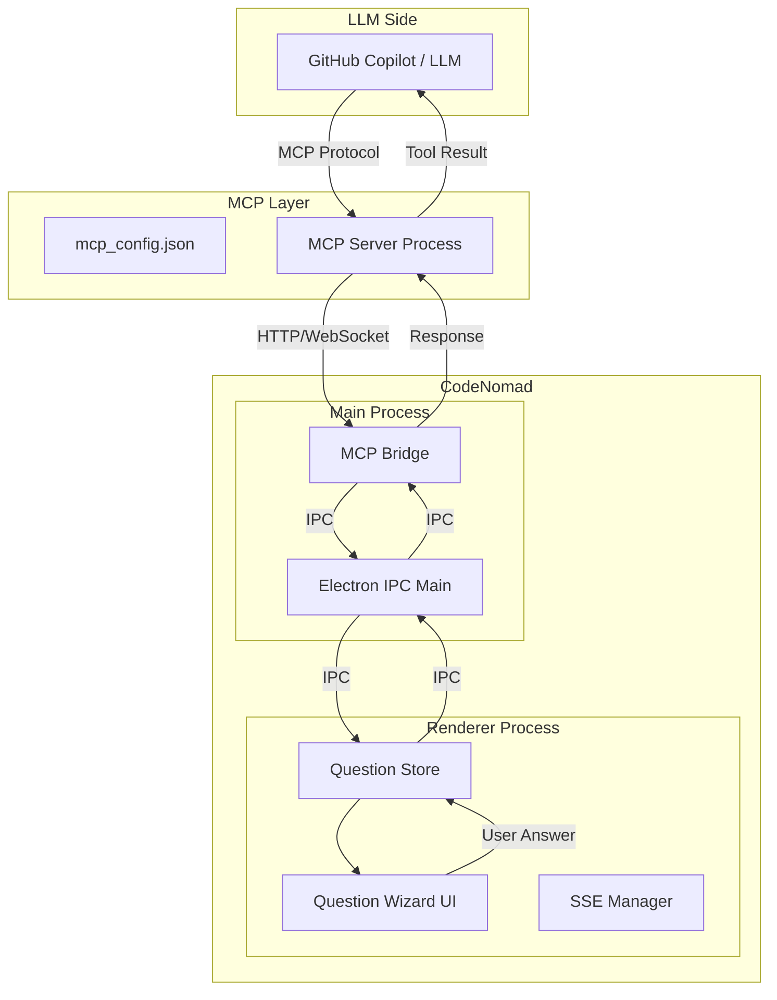
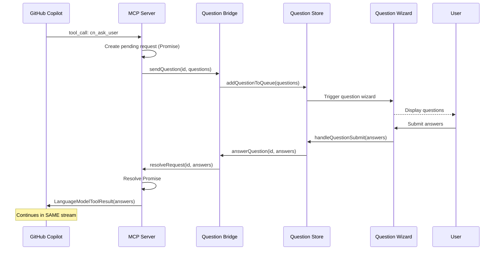
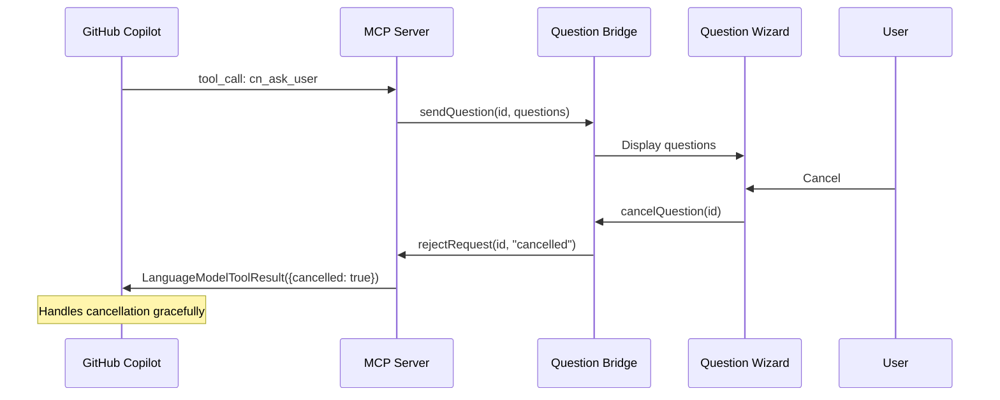

# Technical Design: Native `ask_user` MCP Tool

**Version:** 1.0  
**Date:** 2026-01-18  
**Status:** Draft  

---

## Overview

This document describes the technical architecture for implementing a native `ask_user` tool in CodeNomad using the Model Context Protocol (MCP). (Historical references to cn_ask_user are replaced for accuracy.)

---

## Architecture

### High-Level Architecture

```
┌─────────────────────────────────────────────────────────────────────┐
│                         CodeNomad Electron App                       │
├─────────────────┬───────────────────────┬───────────────────────────┤
│                 │                       │                           │
│   Main Process  │    Renderer Process   │     MCP Server Process    │
│                 │    (UI/React/Solid)   │                           │
│  ┌───────────┐  │  ┌─────────────────┐  │  ┌─────────────────────┐  │
│  │ Electron  │  │  │ Question Wizard │  │  │  MCP Server         │  │
│  │ IPC       │◄─┼──┤ (existing UI)   │◄─┼──┤  - cn_ask_user      │  │
│  │ Bridge    │  │  │                 │  │  │  - Tool Registry    │  │
│  └───────────┘  │  └─────────────────┘  │  └──────────┬──────────┘  │
│        ▲        │                       │             │             │
│        │        │                       │             │             │
└────────┼────────┴───────────────────────┴─────────────┼─────────────┘
         │                                              │
         │                                              ▼
         │                                    ┌─────────────────────┐
         │                                    │ ~/.gemini/antigravity│
         │                                    │ /mcp_config.json    │
         │                                    └─────────────────────┘
         │                                              │
         │                                              ▼
         │                                    ┌─────────────────────┐
         └────────────────────────────────────┤  GitHub Copilot /   │
                                              │  LLM Provider       │
                                              └─────────────────────┘
```

### Component Diagram



---

## Component Details

### 1. MCP Server (`packages/mcp-server`)

The MCP server handles tool registration and LLM communication.

#### Responsibilities
- Register `cn_ask_user` tool with MCP SDK
- Listen for tool invocations from LLM
- Block until user responds
- Return tool result to LLM (same stream)

#### Technology
- `@modelcontextprotocol/sdk` for MCP protocol
- HTTP server on localhost with random port
- Token-based authentication

#### Directory Structure

```
packages/mcp-server/
├── package.json
├── tsconfig.json
└── src/
    ├── index.ts              # Entry point, server startup
    ├── server.ts             # MCP server implementation
    ├── tools/
    │   ├── index.ts          # Tool registry
    │   ├── askUser.ts        # cn_ask_user tool implementation
    │   └── schemas.ts        # Zod schemas for validation
    ├── bridge/
    │   ├── index.ts          # Communication bridge
    │   └── ipc.ts            # Electron IPC communication
    └── config/
        └── registration.ts   # Auto-registration with Antigravity
```

### 2. Question Bridge

Bridges MCP server to CodeNomad's UI.

#### Option A: WebSocket Bridge (Recommended for separation)

```
MCP Server ←→ WebSocket ←→ CodeNomad UI
```

Pros:
- Clean separation of concerns
- Can run MCP server as separate process
- Already have SSE infrastructure

#### Option B: Electron IPC Bridge (Tighter integration)

```
MCP Server ←→ Electron Main ←→ Electron Renderer
```

Pros:
- Lower latency
- Native Electron integration
- Simpler security model

**Recommendation:** Start with **Option B** for faster implementation, with ability to refactor to Option A later.

### 3. UI Integration

Reuse existing question infrastructure:

| Component       | File                                  | Purpose          |
| --------------- | ------------------------------------- | ---------------- |
| Question Store  | `packages/ui/src/stores/questions.ts` | Queue management |
| Question Types  | `packages/ui/src/types/question.ts`   | TypeScript types |
| Question Wizard | `instance-shell2.tsx`                 | UI component     |
| SSE Manager     | `packages/ui/src/lib/sse-manager.ts`  | Event handling   |

---

## Data Flow

### Happy Path: User Answers Question



### Error Path: User Cancels



---

## API Design

### MCP Tool: `cn_ask_user`

#### Input Schema

```typescript
interface CnAskUserInput {
    questions: Array<{
        id?: string;           // Optional question ID
        question: string;      // The question text
        type?: 'text' | 'select' | 'multi-select' | 'confirm';
        options?: string[];    // For select/multi-select
        required?: boolean;    // Default: true
        placeholder?: string;  // For text input
    }>;
    title?: string;           // Optional dialog title
    timeout?: number;         // Optional timeout in ms
}
```

#### Output Schema

```typescript
interface CnAskUserOutput {
    answered: boolean;        // True if user answered
    cancelled: boolean;       // True if user cancelled
    timedOut: boolean;        // True if timeout occurred
    answers: Array<{
        questionId: string;
        values: string[];     // Answer values
        customText?: string;  // Free-form text if allowed
    }>;
}
```

### Internal Bridge API

#### Question Bridge → UI

```typescript
// Event: cn_ask_user.asked
interface QuestionAskedEvent {
    type: 'cn_ask_user.asked';
    requestId: string;
    questions: QuestionInfo[];
    title?: string;
}
```

#### UI → Question Bridge

```typescript
// Event: cn_ask_user.answered
interface QuestionAnsweredEvent {
    type: 'cn_ask_user.answered';
    requestId: string;
    answers: QuestionAnswer[];
}

// Event: cn_ask_user.cancelled
interface QuestionCancelledEvent {
    type: 'cn_ask_user.cancelled';
    requestId: string;
}
```

---

## Security

### Authentication

1. **Bearer Token**: MCP server generates random token on startup
2. **Localhost Only**: Server binds to `127.0.0.1` only
3. **Token Storage**: Token stored in Electron's secure storage

### Request Validation

1. **Zod Schemas**: Validate all inputs
2. **Rate Limiting**: Max 100 requests/minute
3. **Payload Size**: Max 256KB per request

---

## Error Handling

| Error Case                     | Handling                                |
| ------------------------------ | --------------------------------------- |
| MCP server not running         | Fall back to OpenCode's `question` tool |
| User doesn't respond (timeout) | Return timeout result to LLM            |
| Network error                  | Retry with exponential backoff          |
| Invalid input                  | Return validation error to LLM          |
| Multiple instances             | Each instance gets unique port          |

---

## Configuration

### Auto-Registration

On startup, MCP server writes to `~/.gemini/antigravity/mcp_config.json`:

```json
{
    "mcpServers": {
        "codenomad-ask-user": {
            "command": "node",
            "args": [
                "/path/to/mcp-server/dist/index.js",
                "--port", "12345",
                "--token", "abc123..."
            ]
        }
    }
}
```

### Environment Variables

| Variable         | Description           | Default       |
| ---------------- | --------------------- | ------------- |
| `CN_MCP_PORT`    | Fixed port (optional) | Random        |
| `CN_MCP_TIMEOUT` | Question timeout      | 300000 (5min) |
| `CN_MCP_DEBUG`   | Enable debug logging  | false         |

---

## Testing Strategy

### Unit Tests

| Component       | Test Cases                               |
| --------------- | ---------------------------------------- |
| MCP Server      | Tool registration, request handling      |
| Question Bridge | Message serialization, IPC communication |
| Schemas         | Input validation, edge cases             |

### Integration Tests

| Test           | Description                                         |
| -------------- | --------------------------------------------------- |
| Happy Path     | Ask question, user answers, verify no extra request |
| Cancellation   | User cancels, verify graceful handling              |
| Timeout        | Timeout expires, verify proper cleanup              |
| Multi-question | Multiple questions in one call                      |

### E2E Tests

| Test      | Description                                         |
| --------- | --------------------------------------------------- |
| Full Flow | Trigger from Copilot, answer in UI, verify response |
| Fallback  | MCP server down, verify OpenCode tool works         |

---

## Monitoring & Observability

### Logging

```typescript
// Log levels
const log = {
    debug: (msg, data) => console.debug(`[MCP] ${msg}`, data),
    info: (msg, data) => console.info(`[MCP] ${msg}`, data),
    warn: (msg, data) => console.warn(`[MCP] ${msg}`, data),
    error: (msg, data) => console.error(`[MCP] ${msg}`, data),
};
```

### Metrics (Future)

| Metric                    | Type      | Description             |
| ------------------------- | --------- | ----------------------- |
| `mcp_tool_calls_total`    | Counter   | Total tool invocations  |
| `mcp_question_latency_ms` | Histogram | Time from ask to answer |
| `mcp_errors_total`        | Counter   | Errors by type          |

---

## Migration Path

### Phase 1: Parallel Operation
- Both OpenCode's `question` and `cn_ask_user` available
- No breaking changes

### Phase 2: Deprecation (Optional)
- Add system prompt to prefer `cn_ask_user`
- Log when `question` is used

### Phase 3: Removal (Optional)
- Remove OpenCode's `question` from available tools
- Only if all users migrated

---

## Open Design Questions

1. **Process Model**: Should MCP server run in Electron main process or separate Node process?
   - **Recommendation**: Electron main process for simpler IPC

2. **Port Management**: Fixed port vs random port?
   - **Recommendation**: Random port with registration

3. **Multiple Instances**: How to handle multiple CodeNomad windows?
   - **Recommendation**: Single MCP server, route by instance ID

---

## Appendix

### Related Files in CodeNomad

| File                                                      | Relevance                         |
| --------------------------------------------------------- | --------------------------------- |
| `packages/ui/src/stores/questions.ts`                     | Reuse queue logic                 |
| `packages/ui/src/types/question.ts`                       | Reuse type definitions            |
| `packages/ui/src/components/instance/instance-shell2.tsx` | Reuse wizard UI                   |
| `packages/server/src/index.ts`                            | Integration point for MCP startup |

### Reference: Seamless-Agent Implementation

| File                             | What to Learn                |
| -------------------------------- | ---------------------------- |
| `src/mcp/mcpServer.ts`           | MCP server setup             |
| `src/tools/index.ts`             | Tool registration            |
| `src/tools/askUser.ts`           | Blocking until user responds |
| `src/webview/webviewProvider.ts` | UI integration               |
