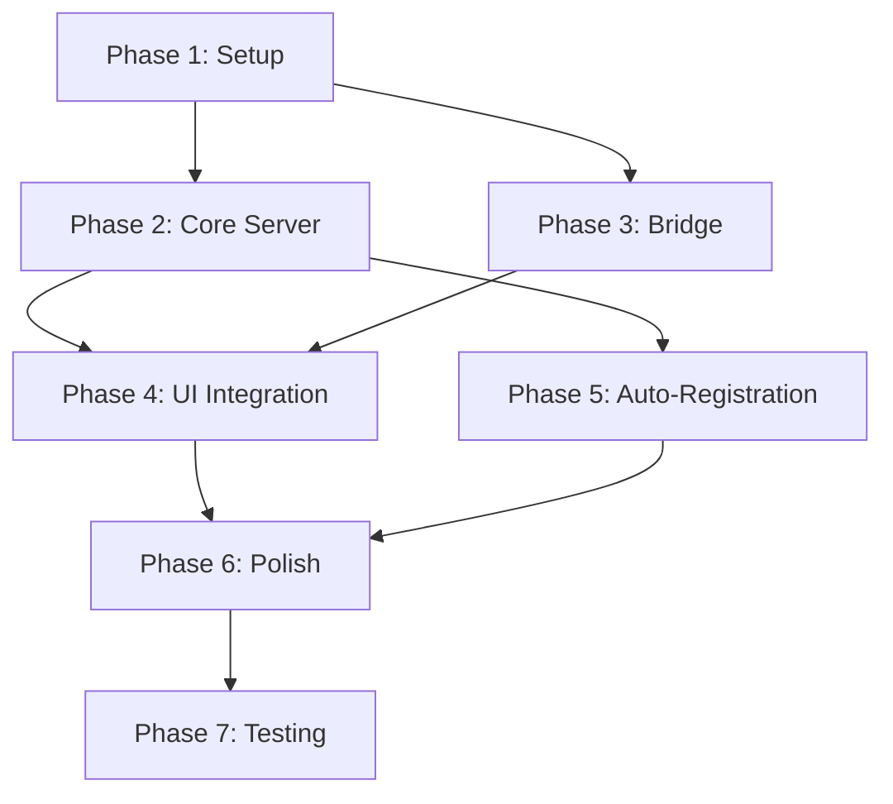

# Implementation Plan: Native `ask_user` MCP Tool

**Version:** 1.0  
**Date:** 2026-01-18  

---

## Overview

Step-by-step implementation plan for building the native `ask_user` MCP tool in CodeNomad.

---

## Prerequisites

Before starting implementation:

- [ ] Review PRD.md for requirements
- [ ] Review DESIGN.md for architecture
- [ ] Ensure familiarity with MCP SDK
- [ ] Understand CodeNomad's existing question infrastructure

---

## Phase 1: Project Setup (Day 1 - Morning)

### 1.1 Create MCP Server Package

Create new package at `packages/mcp-server/`:

```
packages/mcp-server/
├── package.json
├── tsconfig.json
└── src/
    └── index.ts
```

**package.json dependencies:**
```json
{
    "name": "@codenomad/mcp-server",
    "version": "0.1.0",
    "main": "dist/index.js",
    "dependencies": {
        "@modelcontextprotocol/sdk": "^1.25.2",
        "zod": "^4.1.13"
    }
}
```

### 1.2 Add to Workspace

Update root `package.json` workspaces:
```json
{
    "workspaces": [
        "packages/mcp-server",
        // ... existing packages
    ]
}
```

### 1.3 Configure TypeScript

Create `tsconfig.json` extending root config.

---

## Phase 2: Core MCP Server (Day 1 - Afternoon)

### 2.1 Basic Server Setup

**File: `src/server.ts`**

```typescript
import { McpServer } from '@modelcontextprotocol/sdk/server/mcp.js';
import { StreamableHTTPServerTransport } from '@modelcontextprotocol/sdk/server/streamableHttp.js';

export class CodeNomadMcpServer {
    private server: McpServer;
    private transport: StreamableHTTPServerTransport;
    private port: number;
    
    constructor() {
        this.server = new McpServer({
            name: "CodeNomad Ask User",
            version: "1.0.0"
        });
    }
    
    async start(): Promise<void> {
        // Implementation
    }
    
    async stop(): Promise<void> {
        // Implementation
    }
}
```

### 2.2 Tool Registration

**File: `src/tools/askUser.ts`**

```typescript
import { z } from 'zod';

export const AskUserInputSchema = z.object({
    questions: z.array(z.object({
        question: z.string(),
        type: z.enum(['text', 'select', 'multi-select', 'confirm']).optional(),
        options: z.array(z.string()).optional(),
    })),
    title: z.string().optional(),
});

export type AskUserInput = z.infer<typeof AskUserInputSchema>;
```

### 2.3 Pending Request Management

**File: `src/pending.ts`**

```typescript
interface PendingRequest {
    id: string;
    questions: QuestionInfo[];
    resolve: (answers: Answer[]) => void;
    reject: (error: Error) => void;
    createdAt: number;
}

export class PendingRequestManager {
    private pending: Map<string, PendingRequest> = new Map();
    
    add(request: PendingRequest): void { /* ... */ }
    resolve(id: string, answers: Answer[]): boolean { /* ... */ }
    reject(id: string, error: Error): boolean { /* ... */ }
    getAll(): PendingRequest[] { /* ... */ }
}
```

---

## Phase 3: Bridge Implementation (Day 2 - Morning)

### 3.1 Choose Bridge Strategy

**Decision Point:** Electron IPC or WebSocket?

For Phase 1, use **Electron IPC** for simplicity:

```
MCP Server ←→ Electron Main Process ←→ Renderer (UI)
```

### 3.2 IPC Channel Setup

**File: `src/bridge/ipc.ts`**

```typescript
// Main process side
import { ipcMain, BrowserWindow } from 'electron';

export function setupMcpBridge(window: BrowserWindow) {
    // MCP → UI: Send question
    ipcMain.handle('mcp:ask-user', async (event, payload) => {
        window.webContents.send('cn_ask_user.asked', payload);
        
        // Wait for answer from UI
        return new Promise((resolve) => {
            ipcMain.once(`mcp:answer:${payload.requestId}`, (_, answer) => {
                resolve(answer);
            });
        });
    });
}
```

### 3.3 Renderer Side Handler

**File: `packages/ui/src/lib/mcp-bridge.ts` (new file)**

```typescript
// Renderer process side
import { ipcRenderer } from 'electron';
import { addQuestionToQueue, removeQuestionFromQueue } from '../stores/questions';

export function initMcpBridge() {
    ipcRenderer.on('cn_ask_user.asked', (event, payload) => {
        // Add to existing question queue
        addQuestionToQueue(payload.instanceId, {
            id: payload.requestId,
            questions: payload.questions,
            // ... map to existing format
        });
    });
}

export function sendMcpAnswer(requestId: string, answers: Answer[]) {
    ipcRenderer.send(`mcp:answer:${requestId}`, { answers });
}
```

---

## Phase 4: UI Integration (Day 2 - Afternoon)

### 4.1 Extend Question Store

Modify `packages/ui/src/stores/questions.ts` to handle MCP questions:

```typescript
// Add source tracking
interface QueuedQuestion {
    // ... existing fields
    source: 'opencode' | 'mcp';  // NEW
}

// Add handler for MCP answers
export function handleMcpQuestionSubmit(requestId: string, answers: Answer[]) {
    // Send via IPC bridge instead of SDK
    sendMcpAnswer(requestId, answers);
    removeQuestionFromQueue(instanceId, requestId);
}
```

### 4.2 Update Question Wizard

Modify `instance-shell2.tsx` to route answers correctly:

```typescript
const handleQuestionSubmit = async (answers: QuestionAnswer[]) => {
    const question = getPendingQuestion(props.instance.id);
    if (!question) return;
    
    if (question.source === 'mcp') {
        // Use MCP bridge
        handleMcpQuestionSubmit(question.id, answers);
    } else {
        // Existing OpenCode path
        await props.instance.client.question.reply({ ... });
    }
    
    setQuestionWizardOpen(false);
};
```

---

## Phase 5: Auto-Registration (Day 3 - Morning)

### 5.1 Configuration Writer

**File: `src/config/registration.ts`**

```typescript
import * as fs from 'fs';
import * as path from 'path';
import * as os from 'os';

export async function registerWithAntigravity(port: number, token: string) {
    const configPath = path.join(
        os.homedir(), 
        '.gemini', 
        'antigravity', 
        'mcp_config.json'
    );
    
    // Read existing config
    let config = { mcpServers: {} };
    if (fs.existsSync(configPath)) {
        config = JSON.parse(fs.readFileSync(configPath, 'utf8'));
    }
    
    // Add our server
    config.mcpServers['codenomad-ask-user'] = {
        command: 'node',
        args: [
            path.join(__dirname, '..', 'dist', 'index.js'),
            '--port', String(port),
            '--token', token
        ]
    };
    
    // Write config
    fs.mkdirSync(path.dirname(configPath), { recursive: true });
    fs.writeFileSync(configPath, JSON.stringify(config, null, 2));
}
```

### 5.2 Startup Integration

Integrate with CodeNomad startup in `packages/electron-app/electron/main/main.ts`:

```typescript
import { CodeNomadMcpServer } from '@codenomad/mcp-server';

// In app ready handler
const mcpServer = new CodeNomadMcpServer();
await mcpServer.start();
```

---

## Phase 6: Error Handling & Polish (Day 3 - Afternoon)

### 6.1 Timeout Handling

```typescript
// In pending request manager
setTimeout(() => {
    if (this.pending.has(id)) {
        this.reject(id, new Error('Question timeout'));
    }
}, TIMEOUT_MS);
```

### 6.2 Graceful Shutdown

```typescript
// On app quit
app.on('will-quit', async () => {
    await mcpServer.stop();
    await unregisterFromAntigravity();
});
```

### 6.3 Logging

```typescript
const log = {
    info: (msg: string, data?: any) => 
        console.log(`[MCP] ${new Date().toISOString()} ${msg}`, data),
    error: (msg: string, error?: any) => 
        console.error(`[MCP] ${new Date().toISOString()} ${msg}`, error),
};
```

---

## Phase 7: Testing (Day 4)

### 7.1 Unit Tests

```typescript
// tests/askUser.test.ts
describe('cn_ask_user', () => {
    it('should return answers when user responds', async () => {
        // ...
    });
    
    it('should handle cancellation', async () => {
        // ...
    });
    
    it('should timeout after specified duration', async () => {
        // ...
    });
});
```

### 7.2 Integration Tests

```typescript
// tests/integration/mcpFlow.test.ts
describe('MCP Question Flow', () => {
    it('should complete round-trip from LLM to UI and back', async () => {
        // Simulate MCP tool call
        // Verify question appears in UI
        // Simulate user answer
        // Verify response returned to MCP
    });
});
```

### 7.3 Manual E2E Testing

1. Start CodeNomad
2. Verify MCP server registered in `mcp_config.json`
3. Ask Copilot to use `cn_ask_user` tool
4. Answer question in CodeNomad UI
5. Verify response received by Copilot
6. **Verify no extra premium request consumed**

---

## Rollout Plan

### Stage 1: Internal Testing
- Enable for development builds only
- Test with team members
- Gather feedback

### Stage 2: Beta Release
- Add feature flag: `CN_ENABLE_MCP_ASK_USER=true`
- Document in release notes
- Monitor for issues

### Stage 3: GA Release
- Enable by default
- Remove feature flag
- Update documentation

---

## Checklist Summary

### Phase 1: Setup
- [ ] Create `packages/mcp-server` directory
- [ ] Add package.json with dependencies
- [ ] Add tsconfig.json
- [ ] Add to root workspace

### Phase 2: Core Server
- [ ] Implement McpServer class
- [ ] Implement tool registration
- [ ] Implement pending request manager
- [ ] Add Zod schemas

### Phase 3: Bridge
- [ ] Set up Electron IPC channels
- [ ] Create mcp-bridge.ts in UI package
- [ ] Connect main process to renderer

### Phase 4: UI Integration
- [ ] Extend question store for MCP source
- [ ] Update question wizard routing
- [ ] Add MCP answer handler

### Phase 5: Auto-Registration
- [ ] Implement config writer
- [ ] Add startup integration
- [ ] Add shutdown cleanup

### Phase 6: Polish
- [ ] Add timeout handling
- [ ] Add graceful shutdown
- [ ] Add comprehensive logging

### Phase 7: Testing
- [ ] Write unit tests
- [ ] Write integration tests
- [ ] Perform manual E2E testing
- [ ] Verify premium request savings

---

## Dependencies Graph


