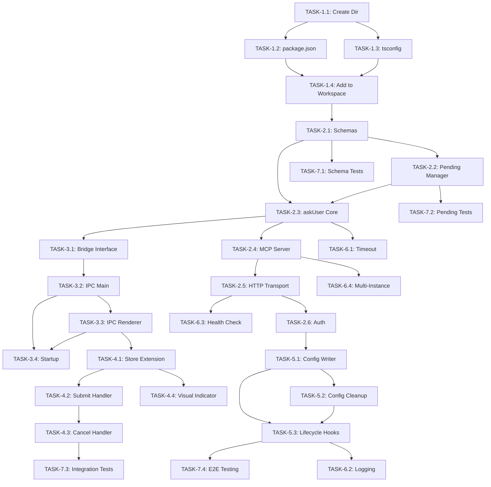

# Detailed Tasks: Native `ask_user` MCP Tool

**Version:** 1.0  
**Date:** 2026-01-18  

---

## Task Overview

| Phase                      | Tasks        | Estimated Time |
| -------------------------- | ------------ | -------------- |
| Phase 1: Setup             | 4 tasks      | 2-3 hours      |
| Phase 2: Core Server       | 6 tasks      | 4-5 hours      |
| Phase 3: Bridge            | 4 tasks      | 3-4 hours      |
| Phase 4: UI Integration    | 4 tasks      | 3-4 hours      |
| Phase 5: Auto-Registration | 3 tasks      | 2 hours        |
| Phase 6: Polish            | 4 tasks      | 2-3 hours      |
| Phase 7: Testing           | 4 tasks      | 3-4 hours      |
| **Total**                  | **29 tasks** | **~3.5 days**  |

---

## Phase 1: Project Setup

### TASK-1.1: Create MCP Server Package Directory

**Priority:** P0  
**Estimated:** 30 min  
**Assignee:** TBD  

**Description:**
Create the new `packages/mcp-server` directory structure.

**Subtasks:**
- [ ] Create directory: `packages/mcp-server/`
- [ ] Create `src/` subdirectory
- [ ] Create `src/tools/` subdirectory
- [ ] Create `src/bridge/` subdirectory
- [ ] Create `src/config/` subdirectory

**Files to Create:**
```
packages/mcp-server/
├── src/
│   ├── tools/
│   ├── bridge/
│   └── config/
```

---

### TASK-1.2: Initialize package.json

**Priority:** P0  
**Estimated:** 30 min  
**Depends on:** TASK-1.1  

**Description:**
Create package.json with required dependencies.

**Subtasks:**
- [ ] Create `packages/mcp-server/package.json`
- [ ] Add `@modelcontextprotocol/sdk` dependency
- [ ] Add `zod` dependency
- [ ] Add build scripts
- [ ] Configure TypeScript output

**Example Content:**
```json
{
    "name": "@codenomad/mcp-server",
    "version": "0.1.0",
    "type": "module",
    "main": "dist/index.js",
    "scripts": {
        "build": "tsc",
        "dev": "tsc --watch"
    },
    "dependencies": {
        "@modelcontextprotocol/sdk": "^1.25.2",
        "zod": "^4.1.13"
    },
    "devDependencies": {
        "typescript": "^5.3.0"
    }
}
```

---

### TASK-1.3: Configure TypeScript

**Priority:** P0  
**Estimated:** 20 min  
**Depends on:** TASK-1.1  

**Description:**
Create TypeScript configuration for the package.

**Subtasks:**
- [ ] Create `packages/mcp-server/tsconfig.json`
- [ ] Extend root TypeScript config if exists
- [ ] Configure output to `dist/` directory
- [ ] Enable strict mode

---

### TASK-1.4: Add to Workspace

**Priority:** P0  
**Estimated:** 15 min  
**Depends on:** TASK-1.2, TASK-1.3  

**Description:**
Add new package to root workspace configuration.

**Subtasks:**
- [ ] Update root `package.json` workspaces array
- [ ] Run `npm install` to link packages
- [ ] Verify package is recognized

---

## Phase 2: Core MCP Server

### TASK-2.1: Implement Zod Schemas

**Priority:** P0  
**Estimated:** 45 min  
**Depends on:** TASK-1.4  

**Description:**
Define input/output schemas for the `cn_ask_user` tool.

**File:** `src/tools/schemas.ts`

**Subtasks:**
- [ ] Define `QuestionInfoSchema`
- [ ] Define `CnAskUserInputSchema`
- [ ] Define `CnAskUserOutputSchema`
- [ ] Export TypeScript types from schemas
- [ ] Add schema parsing helper functions

**Schemas to Define:**
```typescript
// Question types
QuestionType = 'text' | 'select' | 'multi-select' | 'confirm'

// Single question
QuestionInfo = {
    id?: string,
    question: string,
    type?: QuestionType,
    options?: string[],
    required?: boolean,
    placeholder?: string
}

// Tool input
CnAskUserInput = {
    questions: QuestionInfo[],
    title?: string,
    timeout?: number
}

// Tool output
CnAskUserOutput = {
    answered: boolean,
    cancelled: boolean,
    timedOut: boolean,
    answers: Array<{
        questionId: string,
        values: string[],
        customText?: string
    }>
}
```

---

### TASK-2.2: Implement Pending Request Manager

**Priority:** P0  
**Estimated:** 1 hour  
**Depends on:** TASK-2.1  

**Description:**
Manage pending question requests with Promise-based resolution.

**File:** `src/pending.ts`

**Subtasks:**
- [ ] Define `PendingRequest` interface
- [ ] Implement `PendingRequestManager` class
- [ ] Implement `add()` method
- [ ] Implement `resolve()` method
- [ ] Implement `reject()` method
- [ ] Implement `get()` method
- [ ] Implement `getAll()` method
- [ ] Add cleanup for old requests

**Key Methods:**
```typescript
class PendingRequestManager {
    add(request: PendingRequest): void
    resolve(id: string, answers: Answer[]): boolean
    reject(id: string, error: Error): boolean
    get(id: string): PendingRequest | undefined
    getAll(): PendingRequest[]
    cleanup(maxAgeMs: number): void
}
```

---

### TASK-2.3: Implement ask_user Tool Core

**Priority:** P0  
**Estimated:** 1.5 hours  
**Depends on:** TASK-2.1, TASK-2.2  

**Description:**
Implement the main `cn_ask_user` tool function.

**File:** `src/tools/askUser.ts`

**Subtasks:**
- [ ] Create `askUser` async function
- [ ] Generate unique request ID
- [ ] Create Promise that blocks until response
- [ ] Store pending request
- [ ] Emit question to bridge
- [ ] Handle timeout
- [ ] Return formatted result

**Function Signature:**
```typescript
async function askUser(
    input: CnAskUserInput,
    bridge: QuestionBridge,
    pendingManager: PendingRequestManager
): Promise<CnAskUserOutput>
```

---

### TASK-2.4: Implement MCP Server Class

**Priority:** P0  
**Estimated:** 1.5 hours  
**Depends on:** TASK-2.3  

**Description:**
Create the main MCP server class that registers tools.

**File:** `src/server.ts`

**Subtasks:**
- [ ] Import MCP SDK modules
- [ ] Create `CodeNomadMcpServer` class
- [ ] Implement constructor with config
- [ ] Implement `registerTools()` method
- [ ] Register `cn_ask_user` tool
- [ ] Implement `start()` method
- [ ] Implement `stop()` method
- [ ] Add error handling

**Class Interface:**
```typescript
class CodeNomadMcpServer {
    constructor(config: ServerConfig)
    async start(): Promise<void>
    async stop(): Promise<void>
    getPort(): number | undefined
    isRunning(): boolean
}
```

---

### TASK-2.5: Implement HTTP Transport

**Priority:** P0  
**Estimated:** 1 hour  
**Depends on:** TASK-2.4  

**Description:**
Set up HTTP server for MCP transport.

**Subtasks:**
- [ ] Create HTTP server
- [ ] Bind to localhost only
- [ ] Use random available port
- [ ] Set up MCP transport
- [ ] Connect server to transport
- [ ] Add health check endpoint

---

### TASK-2.6: Add Authentication

**Priority:** P0  
**Estimated:** 45 min  
**Depends on:** TASK-2.5  

**Description:**
Implement bearer token authentication.

**Subtasks:**
- [ ] Generate random auth token on startup
- [ ] Store token securely
- [ ] Validate Authorization header on requests
- [ ] Reject unauthorized requests with 401

---

## Phase 3: Bridge Implementation

### TASK-3.1: Design Bridge Interface

**Priority:** P0  
**Estimated:** 30 min  
**Depends on:** TASK-2.3  

**Description:**
Define the interface for communication bridge.

**File:** `src/bridge/types.ts`

**Subtasks:**
- [ ] Define `QuestionBridge` interface
- [ ] Define event types
- [ ] Define message formats
- [ ] Export all types

**Interface:**
```typescript
interface QuestionBridge {
    sendQuestion(requestId: string, questions: QuestionInfo[]): void
    onAnswer(callback: (requestId: string, answers: Answer[]) => void): void
    onCancel(callback: (requestId: string) => void): void
}
```

---

### TASK-3.2: Implement Electron IPC Bridge (Main Process)

**Priority:** P0  
**Estimated:** 1.5 hours  
**Depends on:** TASK-3.1  

**Description:**
Implement the main process side of IPC bridge.

**File:** `src/bridge/ipc.ts`

**Subtasks:**
- [ ] Create `ElectronIpcBridge` class
- [ ] Implement `sendQuestion()` using IPC
- [ ] Set up IPC handler for answers
- [ ] Set up IPC handler for cancellations
- [ ] Handle multiple pending requests
- [ ] Add request routing by ID

---

### TASK-3.3: Implement Renderer Bridge (UI Side)

**Priority:** P0  
**Estimated:** 1 hour  
**Depends on:** TASK-3.2  

**Description:**
Create the renderer process bridge module.

**File:** `packages/ui/src/lib/mcp-bridge.ts` (NEW)

**Subtasks:**
- [ ] Create `initMcpBridge()` function
- [ ] Listen for `cn_ask_user.asked` events
- [ ] Transform to question store format
- [ ] Add to question queue
- [ ] Implement `sendMcpAnswer()` function
- [ ] Implement `sendMcpCancel()` function

---

### TASK-3.4: Integrate Bridge with App Startup

**Priority:** P0  
**Estimated:** 45 min  
**Depends on:** TASK-3.2, TASK-3.3  

**Description:**
Initialize bridge when app starts.

**Subtasks:**
- [ ] Call `initMcpBridge()` in renderer entry
- [ ] Set up IPC handlers in main process
- [ ] Verify bi-directional communication
- [ ] Add connection health logging

---

## Phase 4: UI Integration

### TASK-4.1: Extend Question Store for MCP Source

**Priority:** P0  
**Estimated:** 45 min  
**Depends on:** TASK-3.3  

**Description:**
Add source tracking to differentiate MCP vs OpenCode questions.

**File:** `packages/ui/src/stores/questions.ts`

**Subtasks:**
- [ ] Add `source: 'opencode' | 'mcp'` to QueuedQuestion
- [ ] Update `addQuestionToQueue()` to accept source
- [ ] Add helper to check question source
- [ ] Update type definitions

---

### TASK-4.2: Update Question Wizard Submit Handler

**Priority:** P0  
**Estimated:** 1 hour  
**Depends on:** TASK-4.1  

**Description:**
Route answers to correct destination based on source.

**File:** `packages/ui/src/components/instance/instance-shell2.tsx`

**Subtasks:**
- [ ] Check question source in `handleQuestionSubmit`
- [ ] If MCP: call `sendMcpAnswer()`
- [ ] If OpenCode: use existing SDK path
- [ ] Update cancel handler similarly
- [ ] Add logging for debugging

**Code Change:**
```typescript
const handleQuestionSubmit = async (answers: QuestionAnswer[]) => {
    const question = getPendingQuestion(props.instance.id);
    if (!question) return;
    
    if (question.source === 'mcp') {
        sendMcpAnswer(question.id, answers);  // NEW PATH
    } else {
        await props.instance.client.question.reply({...});  // EXISTING PATH
    }
    
    setQuestionWizardOpen(false);
};
```

---

### TASK-4.3: Handle Cancel for MCP Questions

**Priority:** P1  
**Estimated:** 30 min  
**Depends on:** TASK-4.2  

**Description:**
Implement cancellation for MCP questions.

**Subtasks:**
- [ ] Update `handleQuestionCancel` in wizard
- [ ] Call `sendMcpCancel()` for MCP questions
- [ ] Remove from queue on cancel
- [ ] Close wizard UI

---

### TASK-4.4: Add MCP Question Visual Indicator (Optional)

**Priority:** P2  
**Estimated:** 30 min  
**Depends on:** TASK-4.1  

**Description:**
Optionally show different badge for MCP questions.

**Subtasks:**
- [ ] Add indicator component
- [ ] Show when `source === 'mcp'`
- [ ] Match existing design language

---

## Phase 5: Auto-Registration

### TASK-5.1: Implement Config Writer

**Priority:** P0  
**Estimated:** 45 min  
**Depends on:** TASK-2.6  

**Description:**
Write MCP config on server startup.

**File:** `src/config/registration.ts`

**Subtasks:**
- [ ] Create `registerWithAntigravity()` function
- [ ] Read existing config if present
- [ ] Add/update our server entry
- [ ] Write config atomically
- [ ] Handle permissions errors

---

### TASK-5.2: Implement Config Cleanup

**Priority:** P1  
**Estimated:** 30 min  
**Depends on:** TASK-5.1  

**Description:**
Remove our entry on shutdown.

**File:** `src/config/registration.ts`

**Subtasks:**
- [ ] Create `unregisterFromAntigravity()` function
- [ ] Read config
- [ ] Remove our entry
- [ ] Write updated config

---

### TASK-5.3: Add Startup/Shutdown Hooks

**Priority:** P0  
**Estimated:** 45 min  
**Depends on:** TASK-5.1, TASK-5.2  

**Description:**
Integrate registration with app lifecycle.

**File:** `packages/electron-app/electron/main/main.ts`

**Subtasks:**
- [ ] Start MCP server on app ready
- [ ] Register on successful start
- [ ] Unregister on app quit
- [ ] Handle graceful shutdown
- [ ] Add error recovery

---

## Phase 6: Error Handling & Polish

### TASK-6.1: Implement Timeout Handling

**Priority:** P1  
**Estimated:** 45 min  
**Depends on:** TASK-2.3  

**Description:**
Handle case when user doesn't respond.

**Subtasks:**
- [ ] Add timeout parameter to tool input
- [ ] Start timeout timer on question send
- [ ] Reject pending request on timeout
- [ ] Return timeout result to LLM
- [ ] Clean up UI state

---

### TASK-6.2: Add Comprehensive Logging

**Priority:** P1  
**Estimated:** 30 min  
**Depends on:** All previous tasks  

**Description:**
Add logging throughout the system.

**Subtasks:**
- [ ] Create logging utility
- [ ] Add info logs for happy path
- [ ] Add error logs for failures
- [ ] Add debug logs for troubleshooting
- [ ] Include timestamps and request IDs

---

### TASK-6.3: Add Health Check Endpoint

**Priority:** P1  
**Estimated:** 30 min  
**Depends on:** TASK-2.5  

**Description:**
Add endpoint to verify server is running.

**Subtasks:**
- [ ] Implement `/health` GET endpoint
- [ ] Return server status
- [ ] Include port number
- [ ] Return pending request count

---

### TASK-6.4: Handle Multiple Instances

**Priority:** P2  
**Estimated:** 1 hour  
**Depends on:** TASK-2.4  

**Description:**
Handle multiple CodeNomad instances.

**Subtasks:**
- [ ] Detect existing MCP server
- [ ] Use existing server if running
- [ ] Or start new on different port
- [ ] Route questions to correct instance

---

## Phase 7: Testing

### TASK-7.1: Write Unit Tests for Schemas

**Priority:** P1  
**Estimated:** 30 min  
**Depends on:** TASK-2.1  

**Description:**
Test Zod schemas and parsing.

**File:** `tests/schemas.test.ts`

**Subtasks:**
- [ ] Test valid inputs pass
- [ ] Test invalid inputs fail
- [ ] Test optional fields
- [ ] Test type coercion

---

### TASK-7.2: Write Unit Tests for Pending Manager

**Priority:** P1  
**Estimated:** 45 min  
**Depends on:** TASK-2.2  

**Description:**
Test pending request management.

**File:** `tests/pending.test.ts`

**Subtasks:**
- [ ] Test add request
- [ ] Test resolve request
- [ ] Test reject request
- [ ] Test cleanup old requests
- [ ] Test concurrent requests

---

### TASK-7.3: Write Integration Tests

**Priority:** P1  
**Estimated:** 1.5 hours  
**Depends on:** All implementation tasks  

**Description:**
Test full flow from MCP to UI and back.

**File:** `tests/integration.test.ts`

**Subtasks:**
- [ ] Mock LLM tool call
- [ ] Verify question appears in queue
- [ ] Simulate user answer
- [ ] Verify response returned
- [ ] Test cancellation flow
- [ ] Test timeout flow

---

### TASK-7.4: Manual E2E Testing Checklist

**Priority:** P0  
**Estimated:** 1 hour  
**Depends on:** All implementation tasks  

**Description:**
Perform manual end-to-end testing.

**Checklist:**
- [ ] Start CodeNomad fresh
- [ ] Verify `mcp_config.json` contains our entry
- [ ] Open Copilot chat
- [ ] Prompt: "Ask me a question using cn_ask_user"
- [ ] Verify question appears in CodeNomad
- [ ] Answer the question
- [ ] Verify Copilot receives the answer
- [ ] **CRITICAL: Verify no extra premium request**
- [ ] Test cancellation
- [ ] Test timeout
- [ ] Restart app and verify re-registration

---

## Task Dependencies Diagram



---

## Definition of Done

For each task to be considered complete:

- [ ] Code implemented and compiles
- [ ] Unit tests pass (if applicable)
- [ ] Logging added for debugging
- [ ] Code reviewed (or self-reviewed for solo dev)
- [ ] Documentation updated if needed
- [ ] Verified manually in development
